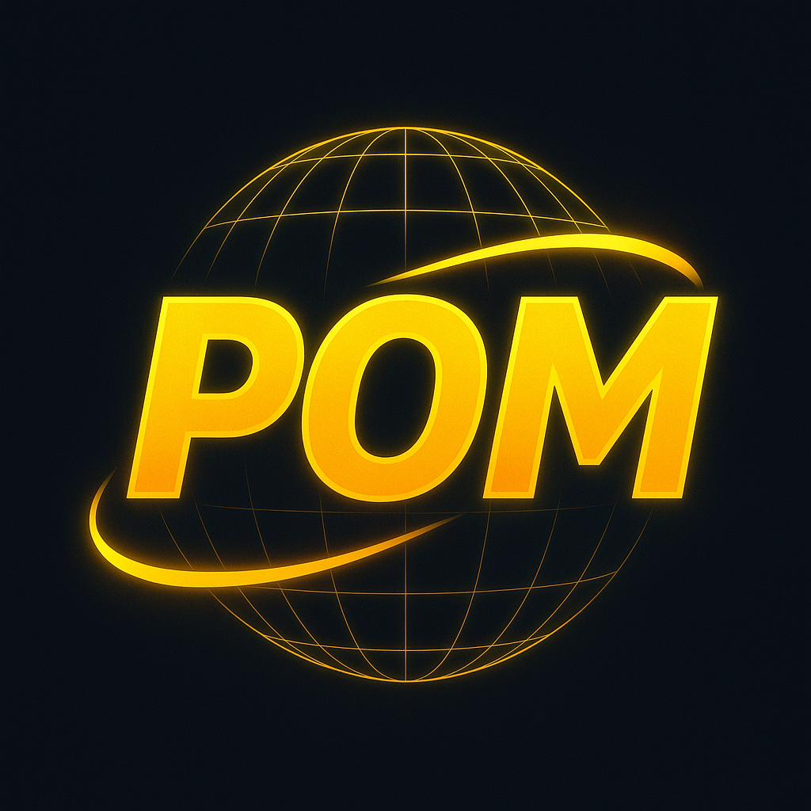

<p align="center">
  
</p>

## Meme Truth Machine

On-chain meme canonization. This project lets you register a meme’s hashed content and associated metadata on Solana, producing a verifiable, immutable record of “truth” for a meme. It includes:

- Anchor-based Solana program (`hashmeme`) for storing meme attestations
- Vite + React + TypeScript frontend (shadcn-ui + Tailwind CSS)
- Optional Node/Express server glue and Supabase integration

### Tech stack

- Solana, Anchor, Rust (SBF)
- TypeScript, React, Vite, Tailwind CSS, shadcn-ui
- Node.js, Express
- Supabase (optional)

### Repository structure

- `meme-truth-machine/` — Full Anchor workspace + app scaffolding for the on-chain program
  - `programs/hashmeme/` — Anchor program source
  - `target/` — Built program artifacts, IDL (`target/idl/hashmeme.json`), and generated client types (`target/types/hashmeme.ts`)
  - `tests/` — Anchor tests (TypeScript) if present
  - `package.json` — Dev scripts for app/server DX
- `src/`, `public/`, `index.html` — Frontend (Vite React) at repo root
- `server/` — Node/Express server (optional)
- `test-ledger/` — Local Solana validator data (optional, useful for offline/localnet)

---

## Quick start

### Prerequisites

- Node.js 18+ and npm (or yarn/pnpm)
- Rust toolchain + Solana CLI + Anchor CLI
  - Solana: `sh -c "$(curl -sSfL https://release.solana.com/v1.18.0/install)"`
  - Anchor (via avm): `cargo install --git https://github.com/coral-xyz/anchor avm --locked` then `avm install latest && avm use latest`

### 1) Install dependencies

From the `meme-truth-machine/` directory:

```bash
cd meme-truth-machine
npm install
```

If you’re using the root frontend, also install at the repo root:

```bash
cd ..
npm install
```

### 2) Start frontend and server (DX)

From `meme-truth-machine/` you can run combined dev if available:

```bash
npm run dev         # Vite dev server
npm run server      # Express server (watch mode)
npm run dev:all     # Run both concurrently (if supported)
```

At repo root, the usual Vite command is:

```bash
npm run dev
```

### 3) Run a local Solana validator (optional)

Use Solana localnet or the provided ledger:

```bash
solana-test-validator --reset \
  --ledger ./test-ledger \
  --limit-ledger-size
```

Configure your CLI to localnet:

```bash
solana config set --url http://127.0.0.1:8899
```

---

## Anchor program: `hashmeme`

Program ID: `EWDGViEZrieLvQ544usdPVLazkaUdaVhBPAqoEG3HA7b`

### Build and deploy

From `meme-truth-machine/`:

```bash
anchor build
anchor deploy --provider.cluster localnet
```

Artifacts:

- IDL: `meme-truth-machine/target/idl/hashmeme.json`
- Client types: `meme-truth-machine/target/types/hashmeme.ts`

### Accounts and instructions

- PDA seed: `("meme", meme_hash)`
- Account `MemeCanon` fields:
  - `meme_hash: [u8; 32]`
  - `image_hash: [u8; 32]`
  - `text_hash: [u8; 32]`
  - `verdict: String`
  - `canon_score: u32`
  - `pumpfun_ca: String`
  - `metadata_uri: String`
  - `bump: u8`

Instruction `register_meme` parameters:

```text
register_meme(
  meme_hash: [u8; 32],
  image_hash: [u8; 32],
  text_hash: [u8; 32],
  verdict: String,
  canon_score: u32,
  pumpfun_ca: String,
  metadata_uri: String,
)
```

### Client usage example (TypeScript)

```ts
import * as anchor from "@project-serum/anchor";
import { PublicKey, SystemProgram } from "@solana/web3.js";

// Load IDL and program ID
import idl from "../meme-truth-machine/target/idl/hashmeme.json";

const provider = anchor.AnchorProvider.env();
anchor.setProvider(provider);

const programId = new PublicKey("EWDGViEZrieLvQ544usdPVLazkaUdaVhBPAqoEG3HA7b");
const program = new anchor.Program(idl as anchor.Idl, programId, provider);

// Example 32-byte hashes (replace with real values)
const memeHash = new Uint8Array(32);
const imageHash = new Uint8Array(32);
const textHash = new Uint8Array(32);

// Derive PDA for MemeCanon
const [memePda] = PublicKey.findProgramAddressSync(
  [Buffer.from("meme"), Buffer.from(memeHash)],
  program.programId
);

await program.methods
  .registerMeme(
    Array.from(memeHash) as any,
    Array.from(imageHash) as any,
    Array.from(textHash) as any,
    "canon", // verdict
    100,      // canon_score
    "PUMPFUN_CA_HERE",
    "https://arweave.net/metadata.json"
  )
  .accounts({
    meme: memePda,
    submitter: provider.wallet.publicKey,
    systemProgram: SystemProgram.programId,
  })
  .rpc();
```

---

## Environment configuration

Create `.env` files where needed.

Frontend (`.env` or `.env.local`):

```dotenv
VITE_RPC_URL=http://127.0.0.1:8899
VITE_SUPABASE_URL=
VITE_SUPABASE_ANON_KEY=
```

Server (`server/.env`):

```dotenv
PORT=3001
OPENAI_API_KEY=
SUPABASE_URL=
SUPABASE_ANON_KEY=
RPC_URL=http://127.0.0.1:8899
```

Anchor/CLI:

```dotenv
ANCHOR_PROVIDER_URL=http://127.0.0.1:8899
ANCHOR_WALLET=~/.config/solana/id.json
```

---

## Scripts (common)

From `meme-truth-machine/`:

- `npm run dev` — Start Vite dev server
- `npm run server` — Start Express server (watch)
- `npm run dev:all` — Run both concurrently
- `npm run build` — Build the frontend
- `npm run preview` — Preview the frontend build

Anchor:

- `anchor build` — Build on-chain program
- `anchor deploy` — Deploy to the configured cluster
- `anchor test` — Run tests (spins up local validator by default)

---

## Notes

- The account space allocation in the program includes headroom for strings. Adjust as needed for your expected maximum sizes.
- If you change the program ID, update it in the Rust program (`declare_id!`) and any clients consuming the IDL.
- For production, point to a reliable RPC and secure all API keys.

## License

MIT (or your preferred license)


